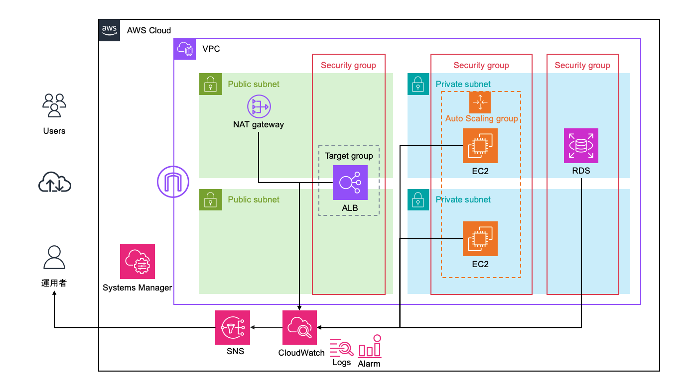
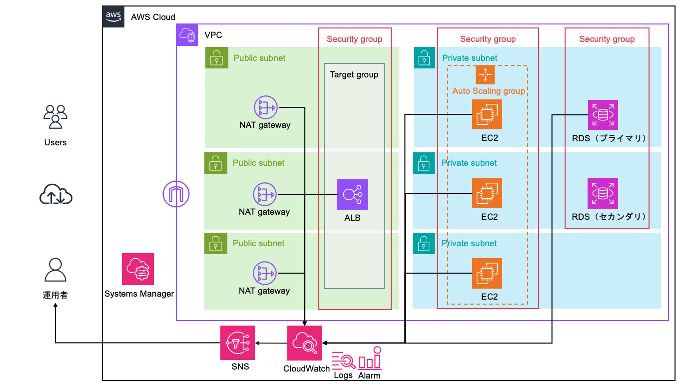

# terraform-aws-3tier-app-infra
 
TerraformでAWS上に3層構成（Web/AP/DB）を意識したインフラ環境を、モジュール化して構築したプロジェクトです。
 
単に「動くインフラ」を作るだけでなく、以下を意識して設計しています。
 
- 環境分離（dev / prod）
- モジュール分割による責務の明確化と再利用性
- 本番運用を意識した3層アーキテクチャ設計
- Terraformによる状態管理設計（S3 backend + DynamoDBロック）
- AWS Well-Architectedフレームワーク（6つの柱）による自己評価と継続的な改善
- GitHub ActionsによるTerraform実行のCI/CD化（OIDC認証、PRベースのplan/apply）
---
 
## 構成
 
- **Web層**：ALB（Application Load Balancer）
- **AP層**：EC2（Auto Scaling Group、Launch Template採用）
- **DB層**：RDS（dev：シングル構成 / prod：Multi-AZ構成）
### アーキテクチャ図
 
**dev環境**

 
**prod環境**

 
通信経路はセキュリティグループのSG参照のみで制御しており、IPアドレス指定は使用していません。
 
| 通信経路 | 制御方法 |
|---|---|
| Internet → ALB | 0.0.0.0/0のHTTP(80)を許可 |
| ALB → EC2 | ALBのSGをソースに指定 |
| EC2 → RDS | EC2のSGをソースに指定 |
 
EC2はSSM Session Manager経由で接続する構成とし、SSHポート（22番）の開放・踏み台サーバを一切排除しています。
 
---
 
## ディレクトリ構成
 
```
.
├── .github
│   └── workflows
│       ├── terraform-plan.yml     # PR作成時にfmt/init/validate/planを自動実行
│       └── terraform-apply.yml    # mainマージ時にinit/validate/applyを自動実行
│       └── terraform-destroy.yml  # 手動トリガー（`workflow_dispatch`）で検証環境のリソースを削除
├── env
│   ├── dev
│   └── prod
├── modules
│   ├── vpc      # ネットワーク基盤
│   ├── ec2      # アプリケーションサーバ（ASG）
│   ├── alb      # 負荷分散
│   ├── rds      # データベース
│   ├── alarm    # CloudWatch Alarm / SNS通知
│   ├── logs     # CloudWatch Logs / ALBアクセスログ / VPCフローログ
│   └── s3       # ALBアクセスログ保存用バケット
└── versions.tf
```
 
モジュール間の依存方向は `vpc → alb → ec2 → rds` の一方向で、循環参照が発生しない構造にしています。各モジュールはvariablesで値を受け取るだけで、他モジュールを直接参照しません。
 
---
 
## 環境ごとの構成差分（dev / prod）
 
| 項目 | dev | prod |
|---|---|---|
| AZ数 | 2AZ | 3AZ |
| NAT Gateway | 1台（共有） | AZごとに配置 |
| EC2台数 | 固定2台 | min2〜max6でスケーリング |
| RDS | シングル構成 | Multi-AZ構成 |
| RDSバックアップ保持期間 | 0日（無効） | 7日間 |
| VPCフローログ | 無効 | 有効 |
| ALBアクセスログ | 無効 | 有効 |
| ログ保持期間 | 7日 | 30日 |
 
devは低コストで検証できる構成、prodは可用性・監査要件を優先した構成として、同一モジュールを環境ごとのvariablesで使い分けています。
 
---
 
## 監視・ログ基盤
 
- **CloudWatch Alarm**：EC2（CPU使用率・ステータスチェック）、ALB（5xxエラー・レスポンスタイム・異常ホスト数）、RDS（CPU・接続数・ストレージ・メモリ）、NAT Gateway（ポート枯渇・パケットドロップ）を監視
- **SNS通知**：アラーム発火時にメール通知
- **CloudWatch Logs**：EC2のシステムログ・Apacheログを転送
- **VPCフローログ**：ACCEPT/REJECT両方を記録し、不審な通信を事後追跡可能に（prod環境）
- **ALBアクセスログ**：S3バケットに保存（SSE-S3暗号化・パブリックアクセス全面ブロック）
各アラームは疑似発火（`aws cloudwatch set-alarm-state`）と実負荷（stress-ngによるCPU負荷、意図的なhttpd停止など）の両方で動作確認済みです。
 
---
 
## CI/CD（GitHub Actions）
 
Terraformの実行を、ローカルでの手動applyからGitHub Actions経由のPRベース運用に移行しています。
 
- **Terraform Plan**：`main`ブランチへのPull Request作成時に実行。`fmt` → `init` → `validate` → `plan` を行い、変更内容をPR上で確認可能にする
- **Terraform Apply**：`main`ブランチへのpush（≒PRマージ）時に実行。`init` → `validate` → `apply -auto-approve` を自動実行する
- **Terraform Destroy**：手動トリガー（`workflow_dispatch`）で検証環境のリソースを削除する用途で用意
AWSへの認証はIAMユーザーの長期アクセスキーを使わず、**GitHub OIDC**でIAMロールを一時的にAssumeする方式を採用しています。信頼ポリシーの`sub`条件でリポジトリを限定し、意図しない主体からのAssumeRoleを防止しています。
 
```bash
# ローカルではなくPR経由でのみapplyされる運用
git checkout -b feature/xxx
# terraform/env/dev 配下を編集してpush → PR作成
# → Terraform Planワークフローが自動実行され、plan結果がPR上で確認できる
# → レビュー後にmainへマージ
# → Terraform Applyワークフローが自動実行される
```
 
CI/CD構築の詳細（OIDC設定、ワークフローの解説）は下記の関連記事を参照してください。
 
---

## デプロイ手順

### ローカルでの動作確認（初回セットアップ・検証用）
 
```bash
cd env/dev  # または env/prod
 
# tfvars.exampleをコピーして環境に合わせて編集
cp terraform.tfvars.example terraform.tfvars
 
terraform init
terraform plan
terraform apply
```
 
`terraform.tfvars` は `.gitignore` で除外しているため、リポジトリには含まれません。
 
### 通常運用（GitHub Actions経由）
 
上記のローカル検証を経たのち、通常の変更はPR作成 → 自動plan確認 → mainマージ → 自動applyのフローで反映します（詳細は「CI/CD（GitHub Actions）」を参照）。
 
---

## 関連記事（Zenn）

設計の意図・トラブルシューティングの詳細は以下の記事にまとめています。

1. 全体設計・モジュール構成編：`https://zenn.dev/aws_iac_notes/articles/1c73b25c97232a`
2. AWS Well-Architectedフレームワークによる自己評価編：`https://zenn.dev/aws_iac_notes/articles/d90856b81e65e0`
3. CloudWatch監視・アラーム実装編（前編）：`https://zenn.dev/aws_iac_notes/articles/6d244171abd217`
4. CloudWatch監視・ログ収集基盤編（後編）：`https://zenn.dev/aws_iac_notes/articles/eda5579e3d083a`
5. GitHub ActionsによるTerraform CI/CD化編：
---

## 今後の拡張予定

- [ ] HTTPS対応（Route53 + ACM）
- [ ] RDS認証情報のParameter Store（SecureString）による動的参照への移行
- [ ] ASGスケーリングポリシーの定義
- [ ] CloudFront導入によるCDN配信
- [x] GitHub ActionsによるTerraform CI（fmt / validate / plan の自動化）
- [ ] IAMロールの権限をAdministratorAccessから最小権限のカスタムポリシーへ移行